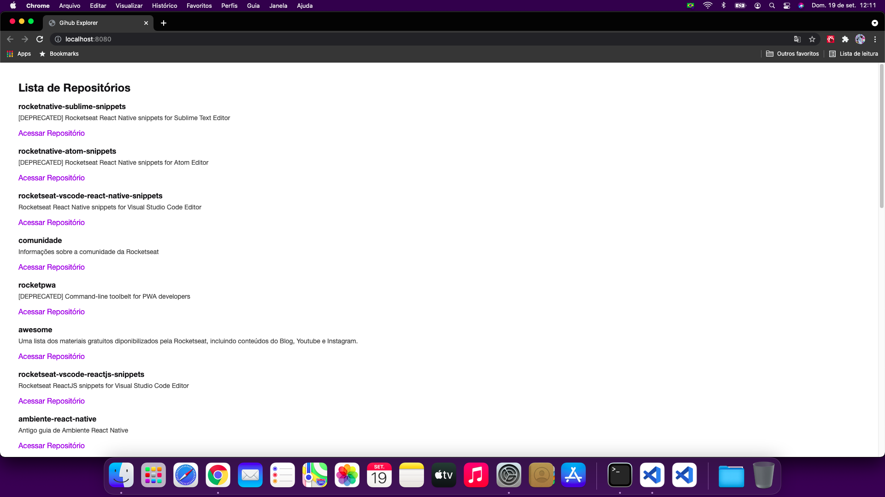

# Github Explorer With React & Typescript

#### Exemplo prático:

 

 

## Funcionamento:

- Com base na API pública disponibilizada do github, a aplicação faz uma leitura e retorna a lista dos repositórios disponíveis, trazendo como informação titulo, descrição e os links para cada repositório.

 

## Projeto teste:

- Projetado para treinar habilidades em programação utilizando React.

